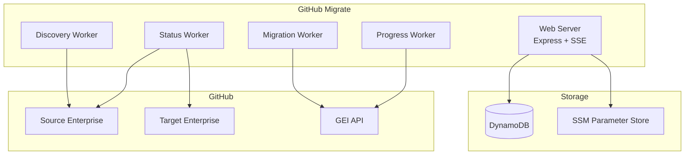
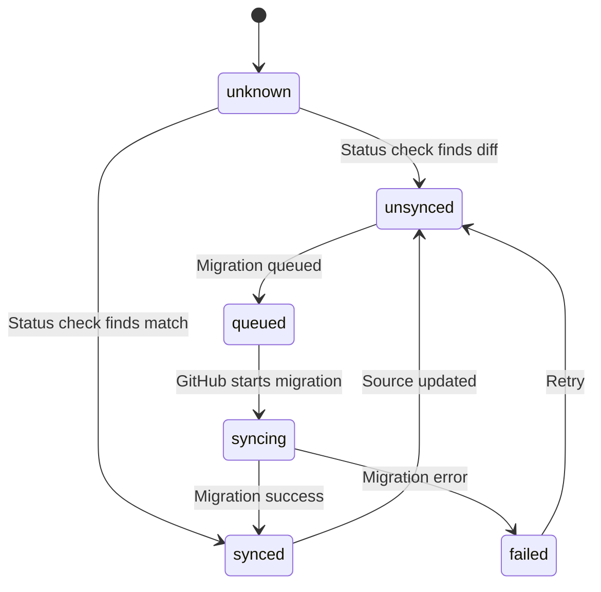

# Architecture

## System Overview

GitHub Migrate is a Node.js/Express application with background workers for managing GitHub Enterprise Importer migrations.



## Components

### Web Server (Main Thread)

- Express server on port 3000
- Serves the dashboard UI and REST API
- Server-Sent Events for real-time updates
- Manages sync configurations
- Protected by Entra ID SSO in production

### Discovery Worker

- Discovers repositories from source organizations
- Triggered on-demand via UI
- Adds new repos with `unknown` status

### Status Worker

- Runs continuously checking repository sync status
- Prioritizes `unknown` repos first
- Compares `pushed_at` timestamps between source and target
- Fetches repository metadata (languages, size, commits, branches)
- Idles when all repos checked within the hour

### Migration Worker

- Queues migrations using `gh gei migrate-repo --queue-only`
- Enforces max 10 concurrent queued repos
- Automatically handles "already contains" errors

### Progress Worker

- Monitors in-progress migrations via GitHub API
- Polls every 60 seconds
- Downloads migration logs on completion
- Detects and marks stale migrations

## Status Flow



### Status Definitions

| Status | Color | Description |
|--------|-------|-------------|
| UNKNOWN | Yellow | Not yet checked |
| UNSYNCED | Yellow | Target missing or out of date |
| QUEUED | Blue | Migration queued, not started |
| SYNCING | Blue | Migration in progress |
| SYNCED | Green | Successfully synced |
| FAILED | Red | Migration failed |
| DELETED | Hidden | Source repo no longer exists |

## Data Storage

### DynamoDB Table

Single table design with partition key `pk` and sort key `sk`:

| Entity | pk | sk |
|--------|----|----|
| Sync Config | `SYNC#<syncId>` | `CONFIG` |
| Repo State | `SYNC#<syncId>` | `REPO#<repoName>` |

GSI `syncId-index` enables querying all repos for a sync.

### SSM Parameter Store

GitHub PATs stored as SecureString at:
```
/container/github-migrate/{env}/secrets/github-pats
```

## Code Structure

```
src/
├── workers/              # Background workers
│   ├── discoveryWorker.ts
│   ├── statusWorker.ts
│   ├── migrationWorker.ts
│   └── progressWorker.ts
├── ui/                   # Frontend (vanilla JS)
│   ├── index.html
│   ├── app.js
│   └── styles.css
├── server.ts             # Express server
├── config.ts             # Configuration
├── state.ts              # State management
├── types.ts              # TypeScript types
├── migration.ts          # GEI helpers
├── github.ts             # GitHub API
└── logs.ts               # Log retrieval
```
