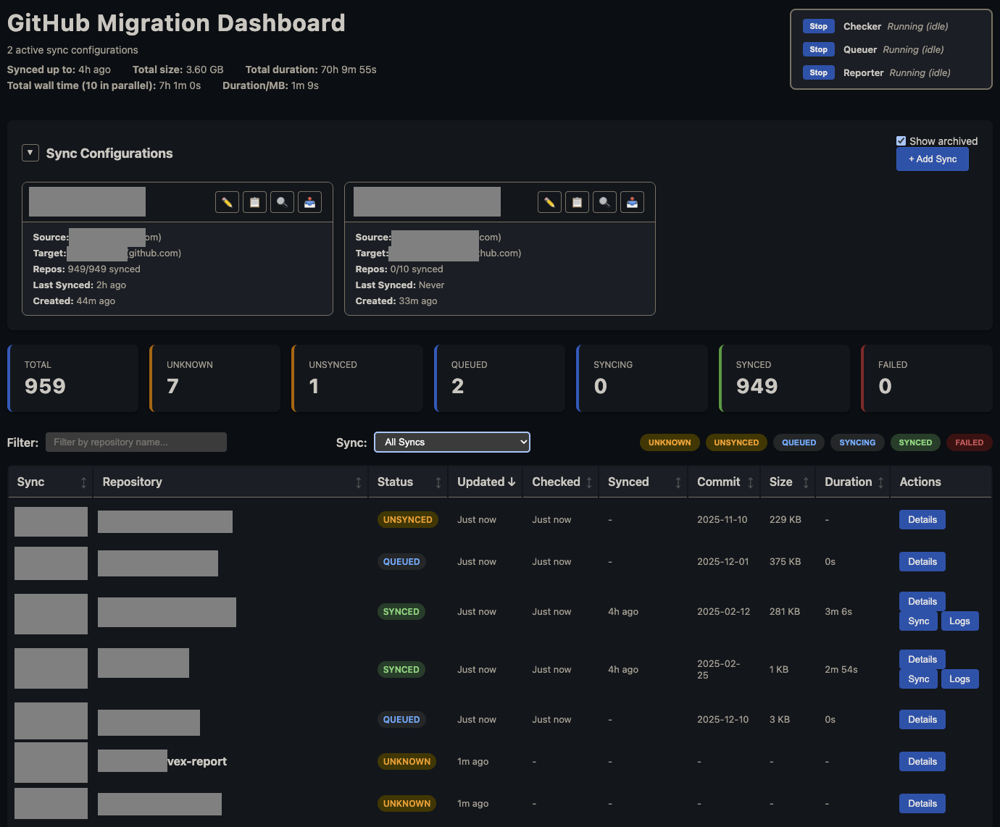

# GitHub Migrate

Web dashboard for managing GitHub Enterprise Importer (GEI) migrations with real-time status updates.



## Background

This tool was created to support the [GitHub Enterprise Cloud migration](https://spirgroup.dev/docs/spir/domain/platform/platform/systems/github/migration_2025/) as outlined in [ADR-0002: GitHub Enterprise Cloud](https://spirgroup.dev/docs/spir/domain/platform/decisions/0002-github/).

The decision to move to GitHub Enterprise Cloud with Managed Users requires migrating repositories from:

- **Existing GitHub organizations** in the current enterprise with Standard Users to a new enterprise with Managed Users
- **Bitbucket Server** for Metria repositories
- Later 2026 to an EU data residency supported `spirgroup.ghe.com`

GitHub Enterprise Importer (GEI) is GitHub's official tool for migrating repositories, preserving pull request history, issue references, and contributor mappings. This dashboard provides a centralized view and automation layer on top of GEI to manage large-scale migrations across multiple organizations.

## Features

- **Multi-Sync Support**: Manage multiple source/target organization sync configurations
- **Real-time Dashboard**: Web interface showing all repositories under migration
- **Four Background Workers**: Independent Discovery, Status, Migration, and Progress Workers
- **Smart Sync Detection**: Automatically checks if repositories need migration
- **Live Status Updates**: Real-time updates via Server-Sent Events
- **Persistent State**: Progress saved to DynamoDB - resume anytime
- **Migration Logs**: View detailed migration logs with automatic log discovery
- **Error Handling**: Retry/resync failed migrations with automatic target cleanup
- **Rate Limit Tracking**: Monitor GitHub API usage with visual indicators
- **Live Application Logs**: Real-time log streaming with filtering and search
- **Admin Mode**: Optional read-only mode for non-administrators
- **Mobile-Responsive**: Hamburger menu and responsive layout for all screen sizes

## Limitations

This tool handles repository synchronization between GitHub Enterprise organizations. It does **not** migrate:

- Project boards
- GitHub Apps and integrations
- Action secrets, environments, and variables
- Team structure and repository ownership
- Webhooks and branch protection rules

## Quick Start

### Prerequisites

1. **Node.js** (v22 or later)
2. **GitHub CLI** (`gh`): [Install here](https://cli.github.com/)
3. **GEI Extension**: `gh extension install github/gh-gei`

### Development

```bash
npm install
npm run dev
```

Access the dashboard at `http://localhost:3000`

### Docker (Local File Storage)

Build and run with the `data/` directory mounted for persistence:

```bash
npm run docker:build
npm run docker:run
```

Or manually:

```bash
docker build -t github-migrate ./dist
docker run --rm -p 3000:3000 -v $(pwd)/data:/app/data github-migrate
```

### Local with DynamoDB

Connect to AWS DynamoDB by setting environment variables:

```bash
export DYNAMODB_TABLE=github-migrate-state-dev
export SSM_PATS_PARAMETER=/container/github-migrate/dev/secrets/github-pats
npm run dev
```

### Production

Deployed via the Golden Path to `https://github-migrate.ambita.com` (SSO protected).

## PAT Requirements

**Source PAT** (Classic PAT):
- Scopes: `repo`, `admin:org`, `workflow`, `admin:repo_hook`
- Must be SSO-authorized for the source organization

**Target PAT** (Classic PAT):
- Scopes: `repo`, `admin:org`, `workflow`, `admin:repo_hook`, `delete_repo`
- Must be SSO-authorized for the target organization

!!! warning "Fine-grained PATs"
    Fine-grained PATs are not supported. Use classic Personal Access Tokens.
