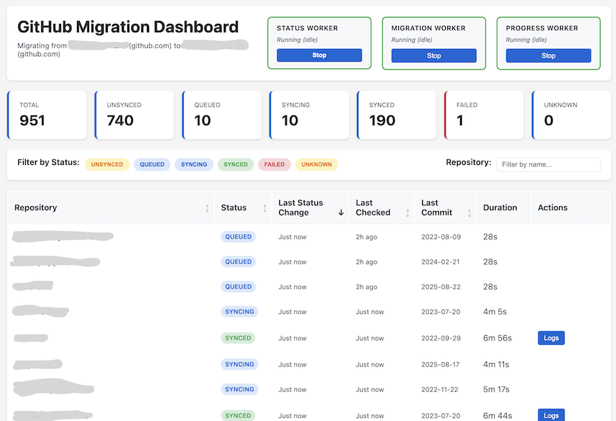

# GitHub Migrate

Web dashboard for managing GitHub Enterprise Importer (GEI) migrations with real-time status updates.



## Features

- **Multi-Sync Support**: Manage multiple source/target organization sync configurations
- **Real-time Dashboard**: Web interface showing all repositories under migration
- **Four Background Workers**: Independent Discovery, Status, Migration, and Progress Workers
- **Smart Sync Detection**: Automatically checks if repositories need migration
- **Live Status Updates**: Real-time updates via Server-Sent Events
- **Persistent State**: Progress saved to DynamoDB - resume anytime
- **Migration Logs**: View detailed migration logs with automatic log discovery
- **Error Handling**: Retry/resync failed migrations with automatic target cleanup

## Limitations

This tool handles repository synchronization between GitHub Enterprise organizations. It does **not** migrate:

- Project boards
- GitHub Apps and integrations
- Action secrets, environments, and variables
- Team structure and repository ownership
- Webhooks and branch protection rules

## Quick Start

### Prerequisites

1. **Node.js** (v22 or later)
2. **GitHub CLI** (`gh`): [Install here](https://cli.github.com/)
3. **GEI Extension**: `gh extension install github/gh-gei`

### Development

```bash
npm install
npm run dev
```

Access the dashboard at `http://localhost:3000`

### Production

Deployed via the Golden Path to `https://github-migrate.ambita.com` (SSO protected).

## PAT Requirements

**Source PAT** (Classic PAT):
- Scopes: `repo`, `admin:org`, `workflow`, `admin:repo_hook`
- Must be SSO-authorized for the source organization

**Target PAT** (Classic PAT):
- Scopes: `repo`, `admin:org`, `workflow`, `admin:repo_hook`, `delete_repo`
- Must be SSO-authorized for the target organization

!!! warning "Fine-grained PATs"
    Fine-grained PATs are not supported. Use classic Personal Access Tokens.
